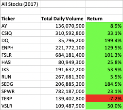
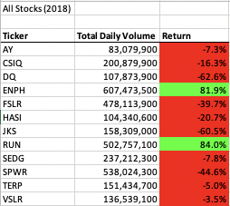
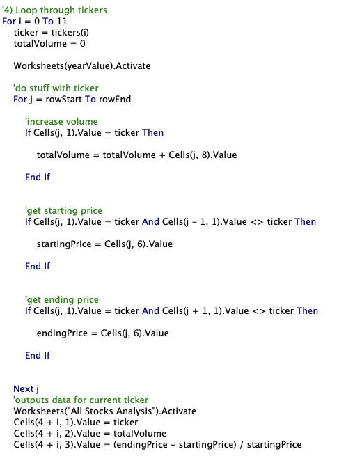
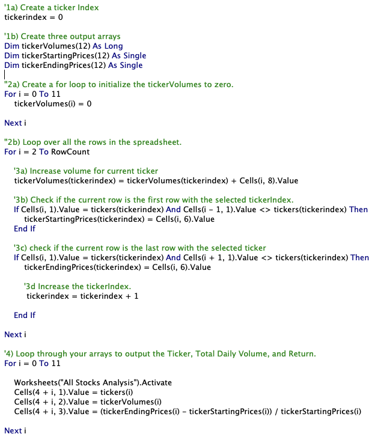

# stock--analysis

# Stock Analysis with Excel VBA

## Overview of Project
### Purpose and Background

The main goal of this project was to analyze data on green energy stocks to understand their performance and inform our investing decisions.

We did this first by creating a VBA script to run analyses on stock performance (as measured by trade volume and percentage change in open/close price). We then refactored the script to run more efficiently. Using a macro allows us to automate tasks and run for multiple analyses with fewer calculation errors.
  
  
## Results
### Stock Performance - 2017 vs. 2018

2017 saw a positive increase in stock price from the start to end of year and 2018 saw a decrease in stock price. Overall, the market or green energy stocks must have been experiencing a downturn in 2018.  

### Script Execution Time - Original vs. Refactored

Refactored Script Runtimes

  
Previous Script Runtimes
* 2017 - 0.2773438
* 2018 - 0.28125

The refactored code ran faster than the previously written script. For 2017 data, it ran 0.210937175 seconds faster
and for 2018 data, ran 0.2109375 seconds faster.
 
Previously, we pulled and output data for the volume, starting price, and ending price of one stock- resetting those variables with each iteration of the loop. The reduced runtime was made possible by use of a tickerindex and arrays to pull and store the volumes, starting prices, and ending prices within one for loop and then outputting them to the sheet in another loop.

Original VBA Code

Refactored VBA Code

  
## Summary
Refactoring code is a good opportunity to make code more succint, extensible, and efficient. In our particular case, refactoring code to use arrays is advantageous because it reduces our runtime. It also leaves us with array of these stored values that can be used if we choose to do further analyses or add additional code; it is cleaner to pull the information from the array versus having to retrieve the info again from within the loop. A disadvantage is that refactoring the macro may cause the script to break in some places; a change in one place will require a change in another. 
